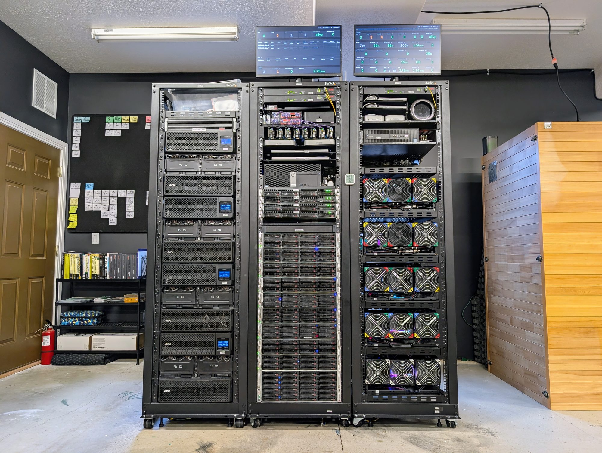

# Node0, in the open

Node0 is a real, self-hosted infrastructure site: two rooms of a home, four racks,
71 hosts, a storage cluster, a hypervisor cluster, GPU hosts behind one model
gateway, and the agents that help run it, built by one person and a set of AI
agents over the summer of 2026. This repository holds everything published about
it: how it is built, the decisions and their trade-offs, what broke and what it
cost, the rules the fleet runs by, and the smallest version of the same pattern
that anyone can start from.

It is for people building a site of their own, at any size from one laptop and
one box upward, and for the agents they point at these pages.

**Read it rendered: [oznog.com/node0](https://oznog.com/node0/).**

## Three starting points

| Your question | Start here | The source in this repository |
|---|---|---|
| Build a starter site | [The seed](https://oznog.com/node0/seed/), then [its companion design](https://oznog.com/node0/seed/design/) | [`content/node0/seed/`](content/node0/seed/) |
| See how this one is built | [As it stands](https://oznog.com/node0/as-it-stands/), then the eleven layer pages | [`content/node0/as-it-stands/`](content/node0/as-it-stands/) |
| Learn from what broke | [116 lessons in six themes](https://oznog.com/node0/lessons/), then [the rules](https://oznog.com/node0/lessons/rules/) | [`content/node0/lessons/`](content/node0/lessons/) |

The six themes: [hardware](content/node0/lessons/hardware/),
[monitoring](content/node0/lessons/monitoring/), [storage](content/node0/lessons/storage/),
[network](content/node0/lessons/network/), [power](content/node0/lessons/power/) and
[operations](content/node0/lessons/operations/). Every lesson is written the same
way: what happened, what it cost, what changed, and the check that now exists.

*The server room from the door: racks 1 to 3, the dashboards above them. Rack 0, the edge, is in the network room next door.*

## Using these pages with an agent

The pages are written to be read by a person and used by their agents. Point an
agent at the rendered site or at this repository and give it your situation. A
prompt that works:

> Read the seed and its companion design, then the as-it-stands pages for the
> layers I name. I have [the hardware on my bench], I need the site to [the
> workloads], and my limits are [budget, power, space]. Ask me what is missing,
> recommend the rung to start on, and cite the page or lesson behind each choice.
> Keep separate what Node0 actually ran, what the seed proposes, and what you infer.

An agent can read the Markdown and YAML directly. The fields worth reading on
every page: `source` (the private document a page was derived from), `sanitized`
(the checklist version it passed and when), `captured` (the date a site page
describes) and, on a lesson, `dates`, `happened`, `cost`, `changed` and `check`.
The seed's own status table says which rungs have actually been run; have the
agent check it before treating a design as demonstrated practice.

## What is here today

Documentation, figures, drawings, photographs and two small tools. This is a Hugo
content repository, not a copy of the site: the layouts live with oznog.com, so a
clone is for reading and reuse, and does not render the pages by itself.

It is the first drop, and what is here first is on purpose: the architecture, the
design decisions with their trade-offs, the lessons and the rules, because those
are what we believe transfer, and because many of the lessons and rules were
distilled from the runbooks in the first place. As the site matures and each
piece proves itself, the other artefacts a builder would want follow the same
route out, runbooks, configuration, the monitoring and management scripts, the
agents' skills, each sanitised for privacy and security before it leaves. [The
landing page](https://oznog.com/node0/#why-it-is-published) says the same at
greater length.

## Files, and how to reuse them

| Path | What it is |
|---|---|
| [`content/node0/`](content/node0/) | The pages: landing, [as it stands](content/node0/as-it-stands/) (eleven layers), [lessons](content/node0/lessons/) (six themes and the rules), [seed](content/node0/seed/), [tools](content/node0/tools/) |
| [`data/capacity-20260921.yaml`](data/capacity-20260921.yaml) | Every figure the pages state, with its source, its date and its unit; estimates are labelled as such |
| [`data/diagrams/`](data/diagrams/) | The eight drawings as data: the stack, the topology, the backup flow, the model path, the alert path, power, the rack elevations, the seed's ladder |
| [`static/images/node0/diagrams/`](static/images/node0/diagrams/) | The drawings as SVG, generated from the data files; nineteen files including one stack strip per layer |
| [`static/images/node0/`](static/images/node0/) | Photographs of the rooms, processed and stripped of metadata |
| [`tools/`](tools/) and [`tests/`](tests/) | The publication gate and the diagram generator, with the gate's tests |

To reuse a drawing, copy the YAML, change the labels, and regenerate:

    python3 tools/diagrams/gen.py          # all drawings; or name one, e.g. stack

It needs Python 3.11 or later and PyYAML, overwrites the SVGs, and does no
sanitising; the generator does not read the capacity file, so a figure that
appears in both is checked by hand at each capture. The [tools page](content/node0/tools/_index.md)
describes both tools in full.

## The gate, and its limits

Before anything is pushed here it goes through `tools/sanitize-check.py` with two
private files that never enter this repository, one of names and one of patterns.
That local run is the gate. The CI job repeats the generic half at the pushed
commit as a second check, after the push has already landed. Neither run proves
a publication safe. The tool cannot read a label in a photograph, decode a secret
someone encoded, or recognise a name that is not on its list, and it scans a tree,
not a history. **A green run is necessary, never sufficient.**

What it checks, and how to run the public half

It refuses IP literals outside the documentation ranges (loopback and unspecified
addresses excepted), MAC addresses, email addresses, credentials in URLs, private
and public key material, API-token shapes, password and token assignments in the
common syntaxes, recovery-material words, the names and paths of credential
stores, and any JPEG, PNG or WebP that carries a segment beyond the ones that
hold pixels and colour. It scans what git would publish, file names included,
and prints a hit as a rule, a file, a line and a length, never the match. Exit 0
is clean, 1 is a hit, 2 is a configuration error. Exceptions live in
[`.sanitize-allow`](.sanitize-allow), scoped to one rule and carrying a reason;
there are none for images.

    python3 -B -m unittest discover -s tests     # the gate's tests
    python3 -B tools/sanitize-check.py           # the public half, over this tree

The maintainers' run adds `--names` and `--rules` with the private files.

## Where the pages come from

Every page is derived from the private Node0 repository through a publication
checklist, and names its source and the checklist version it passed in its front
matter. The source line identifies provenance; it does not give access to the
private document. Humans other than Christoph appear by role, agents by name.
There are no addresses, credentials, serials or paths, and the finance system is
described by shape only.

The site pages describe a dated capture (20260920, with figures re-measured on
20260921 and a few added on 20260922, each dated where it appears). A capture is
not edited into a different day; the next capture is taken when the open list on
the as-it-stands page is closed. Corrections between captures are marked as such
on the page they touch.

## Corrections, and things that should not be here

Found something wrong, unclear or broken? [Open an issue](https://github.com/oznog-holdings/node0-public/issues).
Say which page or file, the capture date it carries, what you think is wrong, and
what you are going by. Corrections are checked against the private source and
republished from there; proposed changes are welcome as suggestions, since this
repository is a mirror and is not merged into directly. [`CONTRIBUTING.md`](CONTRIBUTING.md)
has the detail. This is not a help desk for building your own site, though the
pages are meant to be exactly that.

Found something that should not have been published, an address, a credential, a
name? Do not open a public issue. Use [private vulnerability reporting](https://github.com/oznog-holdings/node0-public/security/advisories/new)
on this repository, or the contact in [oznog.com's security.txt](https://oznog.com/.well-known/security.txt).
[`SECURITY.md`](SECURITY.md) says what happens next.

## Licences and citation

Two licences, by directory; [`LICENSE`](LICENSE) at the root maps them.

| What | Licence | What it asks of you |
|---|---|---|
| Writing, drawings, photographs and data (`content/`, `static/`, `data/`) | [CC BY 4.0](LICENSE-content) | Credit Oznog Holdings LLC, link the licence, and say what you changed |
| Tools and their tests (`tools/`, `tests/`) | [MIT](LICENSE-tools) | Keep the copyright and permission notice |

The files at the root and under `.forgejo/` are documentation and configuration
for this repository and follow the content licence.

To cite a page: *Oznog Holdings LLC, "\<page title\>", Node0 in the open, capture
of 20260920, \<page URL\>*; add the commit permalink where precision matters.

Node0 is built by Oznog Labs; the work is held by Oznog Holdings LLC. Forgejo is
the origin of this repository and GitHub is its mirror, synced on every push.
Copyright Oznog Holdings LLC, 2026.
